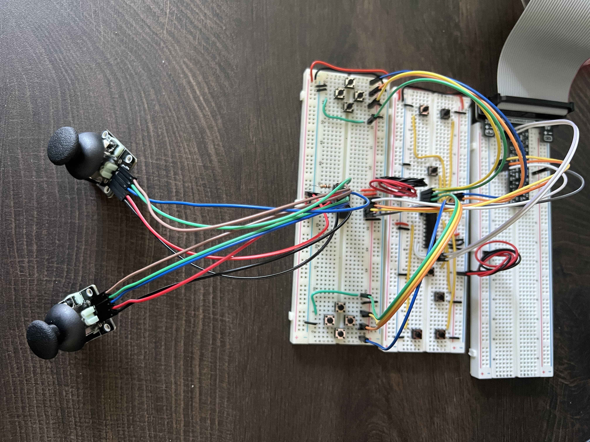

# RetroPie-PSX-Gamepad
A Python script for reading button and joystick values in the Linux User-Space and translating them into inputs for a virtual gamepad.

This project was designed for a handheld RetroPie setup which uses an MCP3008 to handle Analog to Digital conversion and an MCP23017 for GPIO Expansion. The two chips combined can handle a total of 24 inputs (8 for the MCP3008 and 16 for the MCP23017). This does not include any available GPIO pins on the Raspberry Pi itself. There is support for adding button mappings through the native GPIO pins via the gamepad.json file but that is left up to the user.

# Installation
## Requirements
* Python3
## Steps
1. Update / Upgrade
    * `sudo apt update`
    * `sudo apt upgrade`
2. Clone this repository onto your RetroPie device.
    * `git clone https://github.com/nosliwmichael/RetroPie-PSX-Gamepad.git`
3. Install python-uinput
    * `sudo pip3 install python-uinput`
4. Install smbus2
    * `sudo pip3 install smbus2`
5. Update gamepad.json with correct GPIO, PIN, Channel mappings
    * `vim ./RetroPie-PSX-Gamepad/gamepad.json`
6. Test that the script works
    * `sudo python3 ./RetroPie-PSX-Gamepad/src`
7. Setup the script to run as a systemd service so that it starts up on boot.

# Gamepad Configuration
Input mappings for the gamepad can be configured with the gamepad.json file.
Refer to the the python-uinput source code for event code mappings:
https://github.com/tuomasjjrasanen/python-uinput/blob/master/src/ev.py

```
{
    "DEVICE_NAME": "RetroPie-PSX-Gamepad",
    "VENDOR": 6969,
    "PRODUCT": 420,
    "GPIO" : [
    ],
    "MCP3008" : [
        { "name": "BTN_THUMBL", "event_code": "(0x01, 0x13d)", "channel": 0, "port": null, "is_digital": true },
        { "name": "ABS_X", "event_code": "(0x03, 0x00, 0, 1023, 50, 0)", "channel": 1, "port": null, "is_digital": false },
        { "name": "ABS_Y", "event_code": "(0x03, 0x02, 0, 1023, 50, 0)", "channel": 2, "port": null, "is_digital": false },
        { "name": "BTN_THUMBR", "event_code": "(0x01, 0x13e)", "channel": 3, "port": null, "is_digital": true },
        { "name": "ABS_RX", "event_code": "(0x03, 0x03, 0, 1023, 50, 0)", "channel": 4, "port": null, "is_digital": false },
        { "name": "ABS_RY", "event_code": "(0x03, 0x04, 0, 1023, 50, 0)", "channel": 5, "port": null, "is_digital": false }
    ],
    "MCP23017" : [
        { "name": "BTN_MODE", "event_code": "(0x01, 0x13c)", "channel": 7, "port": "A", "is_digital": true },
        { "name": "BTN_START", "event_code": "(0x01, 0x13b)", "channel": 6, "port": "A", "is_digital": true },
        { "name": "BTN_SELECT", "event_code": "(0x01, 0x13a)", "channel": 5, "port": "A", "is_digital": true },
        { "name": "BTN_TL", "event_code": "(0x01, 0x136)", "channel": 4, "port": "A", "is_digital": true },
        { "name": "BTN_TR", "event_code": "(0x01, 0x137)", "channel": 3, "port": "A", "is_digital": true },
        { "name": "BTN_TL2", "event_code": "(0x01, 0x138)", "channel": 2, "port": "A", "is_digital": true },
        { "name": "BTN_TR2", "event_code": "(0x01, 0x139)", "channel": 0, "port": "B", "is_digital": true },

        { "name": "BTN_DPAD_UP", "event_code": "(0x01, 0x220)", "channel": 1, "port": "A", "is_digital": true },
        { "name": "BTN_DPAD_DOWN", "event_code": "(0x01, 0x221)", "channel": 6, "port": "B", "is_digital": true },
        { "name": "BTN_DPAD_LEFT", "event_code": "(0x01, 0x222)", "channel": 0, "port": "A", "is_digital": true },
        { "name": "BTN_DPAD_RIGHT", "event_code": "(0x01, 0x223)", "channel": 7, "port": "B", "is_digital": true },
        { "name": "BTN_SOUTH", "event_code": "(0x01, 0x130)", "channel": 5, "port": "B", "is_digital": true },
        { "name": "BTN_EAST", "event_code": "(0x01, 0x131)", "channel": 2, "port": "B", "is_digital": true },
        { "name": "BTN_WEST", "event_code": "(0x01, 0x134)", "channel": 4, "port": "B", "is_digital": true },
        { "name": "BTN_NORTH", "event_code": "(0x01, 0x133)", "channel": 3, "port": "B", "is_digital": true }
    ]
}
```

<details>
 <summary>A complete list of the available gamepad inputs:</summary>
 <ul>
    <li>Left Joystick</li>
    <ul>
        <li>X-Axis</li>
        <li>Y-Axis</li>
        <li>Click</li>
    </ul>
    <li>Right Joystick</li>
    <ul>
        <li>X-Axis</li>
        <li>Y-Axis</li>
        <li>Click</li>
    </ul>
    <li>D-PAD</li>
    <ul>
        <li>UP</li>
        <li>DOWN</li>
        <li>LEFT</li>
        <li>RIGHT</li>
    </ul>
    <li>ACTION</li>
    <ul>
        <li>A</li>
        <li>B</li>
        <li>X</li>
        <li>Y</li>
    </ul>
    <li>SHOULDER</li>
    <ul>
        <li>LEFT BUMPER</li>
        <li>RIGHT BUMPER</li>
    </ul>
    <li>TRIGGER</li>
    <ul>
        <li>LEFT TRIGGER - Could be analog or digital</li>
        <li>RIGHT TRIGGER - Could be analog or digital</li>
    </ul>
    <li>START</li>
    <li>SELECT</li>
    <li>HOME</li>
    <li>Not yet supported</li>
    <ul>
        <li>POWER - Shutdown the Rapsberry Pi safely</li>
        <li>VOLUME - Analog wheel to adjust volume</li>
    </ul>
 </ul>
</details>

Here's an example of what it would look like to wire all of the available buttons to the MCP3008 and MCP23017 using a breadboard:

